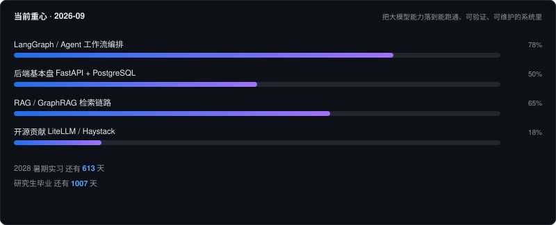

  

---

## 实时数据

> 以上卡片由 GitHub Actions 每 6 小时自动重绘：统计走 GitHub REST，commit 数与贡献热力图走 GraphQL（用仓库自带的 `GITHUB_TOKEN`，不需要额外配置密钥）。卡片配色是深色的，浅色/深色模式下都能看。

---

## 关于我

本科人工智能，研究生转向软件工程与大模型应用。主攻 **LLM 应用工程 / AI Agent 工程化**——把大模型能力落到能跑通、可验证、可维护的系统里，而不是停在 demo。

能力基本盘集中在三块：

- **Agent 工作流编排**：LangGraph / LangChain 状态机、工具调用、结果校验与重试，处理不确定的模型输出。
- **文档摄入与结构化抽取**：PDF → 结构化数据，规则匹配与大模型判定结合，并发、限流、断点续跑这套工程细节。
- **检索与知识图谱**：语义检索 + Cypher 图查询双路召回，解决纯向量检索的"结构缺失"。

科研侧在 LLM 与音乐生成的交叉方向：用 Agent 从模型偏好排名中抽取可解释规则，再用确定性验证器自动验证修复。

---

## 技术栈

| 领域 | 关键词 |
| :--- | :--- |
| AI Agent | LangGraph、LangChain、工具调用、状态机编排、Critic 校验、重试与工作流拆解 |
| 检索增强 | RAG / GraphRAG、Neo4j、Cypher、语义检索、图关系链路追踪 |
| 后端 | Python、FastAPI、PostgreSQL、Pydantic、Asyncio、Docker、Git |
| 模型 | PyTorch、Transformer、REMI / 符号 Tokenization |
| LLM × 音乐（研究） | 验证器引导生成、LLM 反思与规则提取、RLHF / DPO 基础 |

---

## 项目

<b>CodeGraph Pilot</b> — 基于静态分析与知识图谱的代码重构助手 · 个人项目 · 2025.11 起

- AST 批量扫描源码，抽取 Class / Method 实体与调用、继承关系，构建代码知识图谱，补上传统 RAG 缺失的结构信息。
- 双路召回：语义检索定位 + Cypher 图查询追踪链路，支持 2-hop 以上深层依赖分析，压低模型在代码逻辑上的幻觉。
- LangGraph 编排「意图识别 → 图谱检索 → 答案生成 → 质量审查」四阶段状态机，4 种意图自动分类，Critic 角色校验并最多触发 1 次重试。

> 自评：仍是 MVP，架构跑得通但工程完备度不够。放着是因为它真实反映了我对 GraphRAG 的理解，不打算包装成"成熟产品"。

<b>resume-builder</b> — 跨 Agent 简历生成 Skill · MIT 开源

按 JD 从个人 profile.yaml 裁剪改写，生成 1 页 A4 LaTeX 简历 PDF。拆成契约层 / 模板层 / 脚本层三层，支持 Claude Code、Codex、WorkBuddy 接入。

`git clone https://github.com/kuangxiaoc/resume-builder`

<b>基于深度学习的可控变奏生成系统</b> — 本科毕设 · 音乐 AI · 2025.12—2026.03

- 改进 REMI 编码为 Blocked 多轨道分组格式，设计音乐符号 Tokenization 方案。
- Transformer 编码器-解码器，基于骨架与和弦做条件旋律生成。
- 掩码重建任务转增量生成降低学习难度，采样约束提升生成稳定性。

<b>基于 LLM-Agent 与符号 Tokenization 的音乐规则挖掘</b> — 科研项目 · 已投稿 · 2026.05

用 Agent 从神经网络模型的偏好排名中自动提取可解释音乐规则；设计 BAR / Onset / Pitch / Duration 符号方案把 MIDI 编码成 LLM 可处理序列；构建确定性验证器做规则的自动验证与修复循环。

---

## 实习经历

**杭州捷扫科技有限公司 · Agent 开发工程师（实习）** · 2026.01—2026.03

独立开发建筑资料智能提取核心模块：文档分类 → 名称识别 → 证照校验 → 字段抽取 → 结果合并五步流水线，把原始 PDF 转成结构化数据。规则与大模型结合的判定机制过滤错漏资料；Asyncio 并发 + 缓存 / 限流 / 重试 / 断点续跑优化调用成本；动态数据模型与字段映射配置支持多类资料扩展，并保留字段来源信息。

---

## 开源与下一步

短期目标不是"维护自己的一堆 MVP"，而是往真实项目提 PR——目前在看 LiteLLM（AI Gateway）、Haystack（RAG / Agent 编排）、RAGFlow 这几条线，从 issue 复现和文档修正入手。

---

## 联系

- Email：c1156269458@gmail.com
- GitHub：[@kuangxiaoc](https://github.com/kuangxiaoc)
- 简历 PDF 可邮件索取，或用 [resume-builder](https://github.com/kuangxiaoc/resume-builder) 自己跑一份

本页最后更新：2026-09 · 卡片自动刷新

