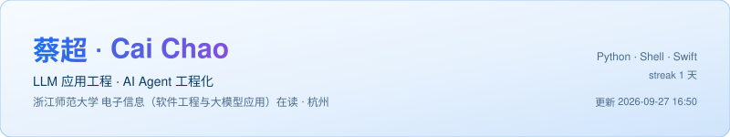
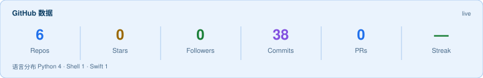
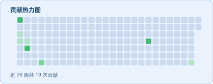
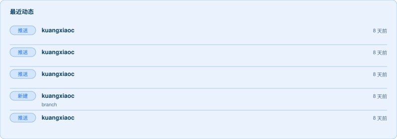

  

---

## 实时数据

> 以上卡片由 GitHub Actions 每 6 小时自动重绘：统计走 GitHub REST，commit 数与贡献热力图走 GraphQL（用仓库自带的 `GITHUB_TOKEN`，不需要额外配置密钥）。卡片配色是深色的，浅色/深色模式下都能看。

---

## 关于我

本科人工智能，研究生转向软件工程与大模型应用。主攻 **LLM 应用工程 / AI Agent 工程化**——把大模型能力落到能跑通、可验证、可维护的系统里，而不是停在 demo。

能力基本盘集中在三块：

- **Agent 工作流编排**：LangGraph / LangChain 状态机、工具调用、结果校验与重试，处理不确定的模型输出。
- **文档摄入与结构化抽取**：PDF → 结构化数据，规则匹配与大模型判定结合，并发、限流、断点续跑这套工程细节。
- **检索与知识图谱**：语义检索 + Cypher 图查询双路召回，解决纯向量检索的"结构缺失"。

科研侧在 LLM 与音乐生成的交叉方向：用 Agent 从模型偏好排名中抽取可解释规则，再用确定性验证器自动验证修复。

---

## 技术栈

| 领域 | 关键词 |
| :--- | :--- |
| AI Agent | LangGraph、LangChain、工具调用、状态机编排、Critic 校验、重试与工作流拆解 |
| 检索增强 | RAG / GraphRAG、Neo4j、Cypher、语义检索、图关系链路追踪 |
| 后端 | Python、FastAPI、PostgreSQL、Pydantic、Asyncio、Docker、Git |
| 模型 | PyTorch、Transformer、REMI / 符号 Tokenization |
| LLM × 音乐（研究） | 验证器引导生成、LLM 反思与规则提取、RLHF / DPO 基础 |

---

## 联系

- Email：c1156269458@gmail.com
- GitHub：[@kuangxiaoc](https://github.com/kuangxiaoc)
- 简历 PDF 可邮件索取，或用 [resume-builder](https://github.com/kuangxiaoc/resume-builder) 自己跑一份

本页最后更新：2026-09 · 卡片自动刷新

